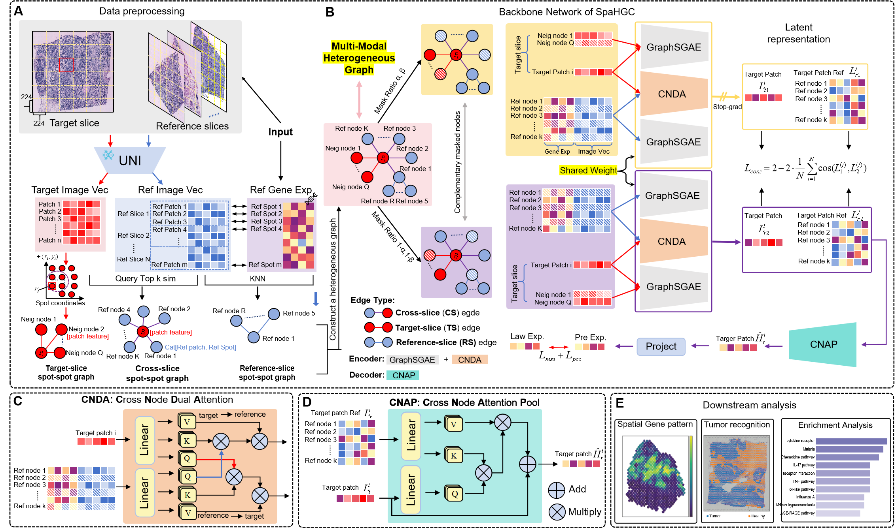

# SpaHGC
## Overview
While spatial transcriptomics (ST) has advanced our understanding of gene expression within tissue context, its high experimental cost limits large-scale application. Predicting ST gene expression from pathology images offers a promising, cost-effective alternative, yet existing methods often struggle to capture the complex spatial relationships across slides. 
To address the challenge, we propose SpaHGC, a multi-modal heterogeneous graph-based model that captures both intra-slice and inter-slice spot-spot relationships from histology images. 
It integrates local spatial context within the target slide and cross-slide similarities computed from image embeddings extracted by a pathology foundation model. 
These embeddings enable inter-slice knowledge transfer across slides. Additionally, SpaHGC incorporates Masked Graph Contrastive Learning to enhance feature representation and transfer spatial gene expression knowledge from reference to target slides, enabling it to model complex spatial dependencies and significantly improve prediction accuracy.
We conducted comprehensive benchmarking on seven histology-ST datasets from different platforms, tissues, and cancer subtypes. The results demonstrate that SpaHGC significantly outperforms existing nine state-of-the-art methods across all evaluation metrics. The model’s predicted gene expression profiles closely align with the ground truth data and accurately correspond to tumor regions. Furthermore, the predictions are significantly enriched in multiple cancer-related pathways, highlighting its strong biological relevance and application potential.

## Installations
- NVIDIA GPU (a single Nvidia GeForce RTX 3090)
- `pip install -r requiremnt.txt`

## Data

## Getting access
The ViT architecture utilizes a self-pretrained model called UNI. You need to request access to the model weights from the Huggingface model page at:[https://huggingface.co/mahmoodlab/UNI](https://huggingface.co/mahmoodlab/UNI). It is worth noting that you need to apply for access to UNI login and replace it in the [demo.ipynb](demo.ipynb).

## Running demo
We provide a examples for predicting super-resolution gene expression data of 10X Visium human dorsolateral prefrontal cortex tissue, please refer to [demo.ipynb](demo.ipynb).

## Baselines
We have listed the sources of some representative baselines below, and we would like to express our gratitude to the authors of these baselines for their generous sharing.

- [iStar](https://github.com/daviddaiweizhang/istar) super-resolution gene expression from hierarchical histological features using a feedforward neural network. 
- [XFuse](https://github.com/ludvb/xfuse) integrates Spatial transcriptomics (ST) data and histology images using a deep generative model to infer super-resolution gene expression profiles. 
- [TESLA](https://github.com/jianhuupenn/TESLA) generates high-resolution gene expression profiles based on Euclidean distance metric, which considers the similarity in physical locations and histology image features between superpixels and measured spots.
- [STAGE](https://github.com/zhanglabtools/STAGE) to generate gene expression data for unmeasured spots or points from Spatial Transcriptomics with a spatial location-supervised Auto-encoder GEnerator by integrating spatial information and gene expression data. 

## Acknowledgements
Part of the code, such as the training framework based on pytorch lightning and the method for mask image in this repository is adapted from the [EGGN](https://github.com/Yan98/EGN). And the Vision Transformer in this repository has been pre-trained by [UNI](https://github.com/mahmoodlab/UNI). We are grateful to the authors for their excellent work.

